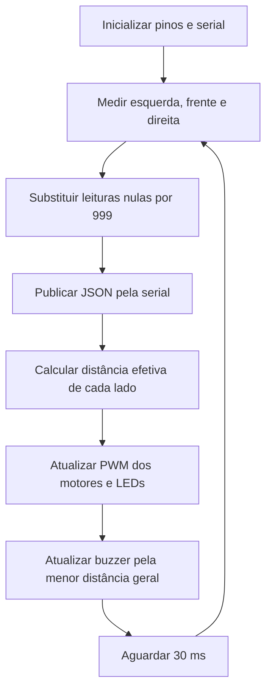

# ECHO: Environmental Collision and Hazard Observer

**Protótipo de tecnologia assistiva para detecção de obstáculos e sinalização de proximidade.**

O ECHO é um projeto de dispositivo vestível voltado ao apoio à mobilidade de pessoas com deficiência visual. Sua proposta é detectar obstáculos suspensos à altura do tronco e da cabeça e comunicar a proximidade por sinais táteis e sonoros, complementando o uso da bengala.

Este README documenta o firmware `code.ino` e contextualiza sua relação com o artigo em desenvolvimento **ECHO: Environmental Collision and Hazard Observer**. Os parâmetros e comportamentos apresentados correspondem ao código fornecido; os recursos da arquitetura proposta no artigo são identificados como etapas de desenvolvimento.

**Autores:**

- Bruno Norton Rocha Pitta
- João Gabriel Teodósio de Oliveira Lima
- Marcos Paulo Lopes de Assunção
- Mauricio Gomes Freire Filho

## Sumário

- [Motivação e objetivos](#motivação-e-objetivos)
- [Estado atual e relação com o artigo](#estado-atual-e-relação-com-o-artigo)
- [Funcionalidades do firmware](#funcionalidades-do-firmware)
- [Componentes e montagem](#componentes-e-montagem)
- [Pinagem](#pinagem)
- [Como o sistema funciona](#como-o-sistema-funciona)
- [Parâmetros configuráveis](#parâmetros-configuráveis)
- [Instalação e execução](#instalação-e-execução)
- [Comunicação serial e integração](#comunicação-serial-e-integração)
- [Roteiro de verificação em bancada](#roteiro-de-verificação-em-bancada)
- [Limitações e pontos de atenção](#limitações-e-pontos-de-atenção)
- [Próximas etapas](#próximas-etapas)
- [Documentação e referências](#documentação-e-referências)
- [Contribuições e licença](#contribuições-e-licença)

## Motivação e objetivos

A bengala é uma ferramenta importante para identificar obstáculos e irregularidades próximas ao solo. A proposta do ECHO concentra-se na detecção de objetos acima dessa área de exploração, como galhos, janelas abertas e estruturas salientes.

O projeto busca transformar medidas de distância em sinais que permitam perceber a direção e a proximidade de um obstáculo. O artigo também estabelece como objetivos a redução da sobrecarga sensorial, a acessibilidade econômica e a construção de uma estrutura vestível confortável. Esses objetivos ainda precisam ser avaliados experimentalmente.

O ECHO é concebido como um recurso complementar à bengala e às técnicas de orientação e mobilidade. A versão documentada é um protótipo de desenvolvimento, com verificações de funcionamento ainda necessárias antes de qualquer avaliação em uso real.

## Estado atual e relação com o artigo

O firmware e o artigo representam escopos diferentes do desenvolvimento:

| Aspecto | Firmware fornecido (`code.ino`) | Arquitetura descrita no artigo |
| --- | --- | --- |
| Plataforma | APIs Arduino e pinagem compatível com Arduino Mega 2560; a placa não é declarada no arquivo | ESP32 |
| Sensores | Três canais: esquerda, frente e direita | Cinco sensores ultrassônicos HC-SR04 |
| Distribuição espacial | Direções lógicas definidas no código; ângulos físicos não informados | Um sensor central, dois a 45° e dois a 90°, distribuídos pelos lados |
| Saída tátil | Dois canais PWM destinados aos motores | Motores de vibração ERM para sinalização direcional |
| Saída sonora | Buzzer com bipes e tom contínuo | Feedback auditivo previsto na proposta |
| Sinalização visual | Dois LEDs vermelhos com controle PWM | Não detalhada na arquitetura textual |
| Comunicação | JSON pela serial a 9600 baud | Aplicação externa não detalhada |
| Estrutura | O firmware não especifica o encapsulamento | Visor ergonômico, fabricação FDM e passagem interna de fios |
| Alimentação vestível | Gestão de bateria não implementada no firmware | Compartimento para bateria LiPo previsto |

A identificação do Mega 2560 é uma **inferência de compatibilidade**, baseada especialmente nos pinos 22 e 44. A documentação oficial confirma que os pinos 2, 3, 8 e 44 usados como saídas PWM estão disponíveis nessa placa. A placa efetivamente utilizada deve ser confirmada na montagem. Consulte a [documentação do Mega 2560](https://docs.arduino.cc/hardware/mega-2560/) e a [lista oficial de pinos PWM](https://support.arduino.cc/hc/en-us/articles/9350537961500-Use-PWM-output-with-Arduino).

O rascunho do artigo ainda contém texto de modelo no resumo e trechos sobre um sistema antifurto nas seções de resultados e conclusão. Esses trechos não fundamentam resultados do ECHO. Por isso, este README descreve a proposta e o comportamento verificável no código, sem atribuir ao dispositivo métricas de precisão, autonomia, conforto ou eficácia que ainda não foram apresentadas.

## Funcionalidades do firmware

- Leitura sequencial de três sensores ultrassônicos.
- Conversão do tempo de retorno do eco em distância inteira, em centímetros.
- Combinação da leitura frontal com cada leitura lateral.
- Controle PWM independente dos canais de motor esquerdo e direito.
- Controle de brilho dos LEDs vermelhos conforme a distância efetiva de cada lado.
- Alerta sonoro cuja cadência aumenta conforme o obstáculo se aproxima.
- Tom contínuo para distância mínima detectada de até 5 cm.
- Publicação das leituras em JSON, uma mensagem por linha.
- Tratamento de leituras nulas com um valor sentinela interno.

O sketch utiliza funções do núcleo Arduino e não inclui bibliotecas externas.

## Componentes e montagem

### Componentes para reproduzir os canais do firmware

| Quantidade | Componente | Observação |
| --- | --- | --- |
| 1 | Placa compatível com a pinagem atual | Arduino Mega 2560 como referência de compatibilidade |
| 3 | Sensores ultrassônicos com interface TRIG/ECHO | O artigo identifica o modelo HC-SR04 |
| 2 | Motores de vibração | Tensão, corrente e modelo devem ser definidos conforme a montagem |
| 2 | Estágios de acionamento dos motores | Drivers ou circuitos com transistor/MOSFET e proteção adequada |
| 1 | Buzzer compatível com `tone()` | Preferencialmente passivo, para reproduzir o tom de 500 Hz |
| 2 | LEDs vermelhos | Um para cada canal lateral |
| 2 | Resistores limitadores para os LEDs | Dimensionados conforme LED e tensão de alimentação |
| Conforme montagem | Protoboard, jumpers, cabo USB e alimentação | Confirmar tensão e capacidade de corrente dos componentes |

Os drivers e as proteções são requisitos de montagem, mas seu circuito não pode ser deduzido do sketch. A lista não constitui um esquema elétrico completo nem um orçamento de componentes.

### Orientações de conexão

1. Posicione os sensores nas direções esquerda, frontal e direita.
2. Conecte TRIG e ECHO aos pinos indicados na tabela de pinagem.
3. No HC-SR04 convencional de 5 V, conecte VCC à alimentação de 5 V e GND ao terra comum, conforme o [datasheet do sensor](https://cdn.sparkfun.com/datasheets/Sensors/Proximity/HCSR04.pdf).
4. Use os pinos de motor como sinais de controle dos respectivos drivers. Os motores precisam de um estágio de potência; não devem ser alimentados diretamente pelos GPIOs.
5. Conecte cada LED com resistor limitador. O mapeamento de brilho pressupõe que um valor PWM maior aumente o brilho.
6. Conecte o buzzer pelo circuito de acionamento compatível com sua corrente e tensão.
7. Mantenha terra comum entre placa, sensores e drivers, quando a topologia utilizada exigir essa referência.

A migração para ESP32 exige revisão da pinagem, do PWM e da compatibilidade dos níveis elétricos, especialmente da saída ECHO do sensor utilizado. Não se deve transportar a ligação de uma montagem de 5 V para outra placa sem essa revisão.

## Pinagem

Os números abaixo correspondem exatamente às constantes de `code.ino`:

| Componente | Sinal / constante | Pino | Modo |
| --- | --- | --- | --- |
| Sensor esquerdo | TRIG / `trigPinEsq` | 6 | Saída |
| Sensor esquerdo | ECHO / `echoPinEsq` | 7 | Entrada |
| Sensor frontal | TRIG / `trigPinFrente` | 4 | Saída |
| Sensor frontal | ECHO / `echoPinFrente` | 5 | Entrada |
| Sensor direito | TRIG / `trigPinDir` | 12 | Saída |
| Sensor direito | ECHO / `echoPinDir` | 11 | Entrada |
| Driver do motor esquerdo | `motorEsqPin` | 8 | Saída PWM |
| Driver do motor direito | `motorDirPin` | 3 | Saída PWM |
| Buzzer | `buzzerPin` | 22 | Saída com `tone()` |
| LED vermelho esquerdo | `ledEsqPin` | 44 | Saída PWM |
| LED vermelho direito | `ledDirPin` | 2 | Saída PWM |

O comentário do código registra a mudança do motor esquerdo do pino 9 para o pino 8 para evitar conflito com o buzzer. No núcleo AVR do Mega 2560, `tone()` utiliza o Timer2, associado ao PWM dos pinos 9 e 10; o pino 8 utiliza o Timer4. Isso explica a mudança, mesmo com o sinal do buzzer saindo no pino 22. Fontes: [implementação de `tone()`](https://github.com/arduino/ArduinoCore-avr/blob/master/cores/arduino/Tone.cpp) e [mapeamento de pinos do Mega](https://github.com/arduino/ArduinoCore-avr/blob/master/variants/mega/pins_arduino.h).

## Como o sistema funciona



### 1. Inicialização

Em `setup()`, o firmware configura TRIG e os atuadores como saídas, ECHO como entrada e a serial a 9600 baud. Os motores recebem inicialmente o comando PWM `255`, e os LEDs recebem `0`.

O efeito físico do comando inicial dos motores depende da polaridade dos drivers, discutida abaixo.

### 2. Medição de distância

A função `medirDistancia(pinoTrig, pinoEcho)`:

1. Mantém TRIG em nível baixo por 2 µs.
2. Gera um pulso alto de 10 µs para iniciar a medição.
3. Mede a duração do pulso ECHO com `pulseIn(pinoEcho, HIGH, 20000)`.
4. Retorna `0` se a chamada não produzir uma duração válida.
5. Calcula a distância pela expressão:

```text
distância (cm) = duração do eco (µs) × 0,034 / 2
```

O fator `0,034` representa a velocidade do som aproximada em centímetros por microssegundo. A divisão por dois considera a ida e a volta da onda. O retorno é armazenado em `int`, descartando a parte fracionária.

O timeout configurado é de 20.000 µs, ou 20 ms, por chamada. A faixa de reação de 5 a 30 cm é uma escolha do firmware, distinta do alcance nominal do sensor.

### 3. Tratamento de leituras nulas

No início de `loop()`, qualquer distância igual a `0` é substituída por `999`. Esse valor representa uma leitura sem distância útil para a lógica do programa, e não uma medição de 999 cm.

Como `999` é maior que o limiar de 30 cm, essa leitura não gera alerta por si só. Se os três canais retornarem zero, o programa segue a condição de distância fora da faixa de reação.

Na transmissão serial, `999` é substituído por `30`. Essa escolha simplifica a saída, mas impede o consumidor de distinguir uma leitura inválida de uma leitura real de 30 cm.

### 4. Combinação de direções

O firmware calcula:

```cpp
int distEfetivaEsq = min(distEsq, distFrente);
int distEfetivaDir = min(distDir, distFrente);
```

Assim, a leitura frontal participa dos dois canais de saída. Um obstáculo frontal pode afetar os dois lados; uma aproximação lateral tende a afetar o canal correspondente, desde que a frente não apresente distância ainda menor.

**Exemplo:** para esquerda = 25 cm, frente = 10 cm e direita = 40 cm, as duas distâncias efetivas são 10 cm. Já para esquerda = 8 cm, frente = 50 cm e direita = 50 cm, apenas a distância efetiva esquerda entra na faixa de reação.

### 5. PWM dos motores e LEDs

Para distâncias efetivas de até 30 cm, o código aplica dois mapeamentos lineares:

```cpp
map(distanciaEfetiva, 5, 30, 0, 255);   // comando do motor
map(distanciaEfetiva, 5, 30, 255, 0);   // comando do LED
```

Os valores são limitados ao intervalo de 0 a 255 por `constrain()`.

| Distância efetiva | PWM enviado ao motor | PWM enviado ao LED |
| --- | --- | --- |
| Até 5 cm | 0 | 255 |
| 10 cm | 51 | 204 |
| 15 cm | 102 | 153 |
| 20 cm | 153 | 102 |
| 25 cm | 204 | 51 |
| 30 cm | 255 | 0 |
| Acima de 30 cm | 255 | 0 |

**Polaridade do acionamento:** o comando do motor diminui quando o obstáculo se aproxima. Com um driver ativo em nível alto, isso tende a reduzir o acionamento perto do obstáculo e manter o comando máximo quando ele está distante. Com um driver cuja lógica efetiva seja invertida, o efeito pode corresponder à intenção do artigo de aumentar a vibração com a proximidade.

A topologia do driver não foi fornecida. Portanto, é necessário confirmar a relação entre PWM e vibração na bancada antes de afirmar que o firmware produz vibração mais intensa perto de obstáculos. O mapeamento usado é linear; não implementa uma relação matemática do tipo `1/distância`.

### 6. Alerta sonoro

O buzzer considera a menor leitura dos três sensores:

```cpp
int menorDistanciaGeral = min(distEsq, min(distFrente, distDir));
```

| Menor distância | Comportamento sonoro |
| --- | --- |
| Acima de 30 cm | Nenhum novo bipe; interrompe um tom contínuo que estivesse ativo |
| Maior que 5 cm e até 30 cm | Bipes de 500 Hz com duração de 80 ms |
| Até 5 cm | Tom contínuo de 500 Hz |

Na faixa intermediária, o intervalo entre os disparos é calculado por:

```cpp
map(menorDistanciaGeral, 5, 30, 100, 800);
```

Por exemplo, 10 cm correspondem a 240 ms, 20 cm a 520 ms e 30 cm a 800 ms. O intervalo representa o tempo entre inícios de bipes, não apenas o período de silêncio. O valor de 100 ms é o extremo do mapeamento em 5 cm; nessa distância, a condição de tom contínuo tem prioridade.

`ultimoTempoBuzzer` armazena o instante do último bipe, e `somContinuo` controla as transições do tom contínuo. O agendamento usa `millis()`, mas as medições e o `delay(30)` ainda bloqueiam a execução do laço. Por isso, o intervalo observado pode ser maior que o valor calculado.

Ao sair da faixa de reação durante um bipe temporizado, o código deixa de disparar novos bipes; o bipe em andamento pode terminar seus 80 ms.

## Parâmetros configuráveis

| Parâmetro | Valor atual | Local / efeito |
| --- | --- | --- |
| `distanciaMaxima` | 30 cm | Limite superior da faixa de reação |
| `distanciaMinima` | 5 cm | Limite de reação máxima dos mapeamentos e início do tom contínuo |
| Baud rate | 9600 | `Serial.begin(9600)` |
| Timeout de ECHO | 20.000 µs | Terceiro argumento de `pulseIn()` |
| Velocidade do som aproximada | 0,034 cm/µs | Conversão de duração em distância |
| Frequência sonora | 500 Hz | Chamadas de `tone()` |
| Duração do bipe | 80 ms | Chamada de `tone()` com duração |
| Extremos do intervalo de bipe | 100 e 800 ms | Mapeamento da menor distância |
| Pausa final do laço | 30 ms | `delay(30)` |
| Sentinela interno | 999 | Substituição de leituras nulas |
| Valor serial para o sentinela | 30 cm | Expressões usadas em `Serial.print()` |

Somente os limiares de distância e os pinos estão definidos como constantes nomeadas no início do arquivo. Os outros parâmetros aparecem diretamente nas funções.

Ao alterar os limiares, mantenha `distanciaMinima < distanciaMaxima`. Revise também a substituição serial por `30`, pois esse valor é literal e não acompanha automaticamente uma alteração de `distanciaMaxima`.

## Instalação e execução

### Requisitos

- Arduino IDE com o pacote da placa utilizada.
- Arquivo `code.ino` fornecido com o projeto.
- Montagem compatível com a pinagem e os níveis elétricos documentados.
- Cabo USB adequado para programação e comunicação serial.

### Procedimento

1. Confira a placa e a montagem, incluindo os drivers dos motores.
2. Abra `code.ino` na Arduino IDE. Se a IDE solicitar organizar o sketch, aceite a criação da pasta `code/` contendo `code.ino`.
3. Para uma montagem confirmada com Mega 2560, instale ou selecione **Arduino AVR Boards** e escolha **Arduino Mega or Mega 2560**, com processador **ATmega2560** quando essa opção aparecer.
4. Selecione a porta correspondente à placa.
5. Execute **Verificar** para compilar o sketch.
6. Execute **Carregar** para gravar o firmware.
7. Abra o Monitor Serial e selecione **9600 baud**.
8. Confirme a chegada de uma linha JSON por ciclo e realize as verificações de bancada descritas abaixo.

Não há configuração de Wi-Fi, Bluetooth, servidor ou credenciais no firmware fornecido. A referência a Next.js aparece em um comentário sobre o formato serial.

## Comunicação serial e integração

A saída possui o formato:

```json
{"E":15,"F":30,"D":8}
```

| Campo | Significado | Unidade |
| --- | --- | --- |
| `E` | Distância do sensor esquerdo | cm |
| `F` | Distância do sensor frontal | cm |
| `D` | Distância do sensor direito | cm |

Cada mensagem é encerrada por `Serial.println()`. A serial transmite as leituras individuais, antes da combinação das distâncias efetivas dos atuadores.

**Regras de interpretação:**

- Um valor `30` pode representar distância real de 30 cm ou substituição de uma leitura inválida.
- Distâncias válidas maiores que 30 cm são transmitidas normalmente; a saída não é limitada a 30 cm.
- Não são enviados estados de validade, timestamps, valores PWM nem estado do buzzer.
- A taxa de atualização é variável, pois depende das medições e do tempo de transmissão.

### Uso em uma interface externa

O formato permite que uma aplicação receba as distâncias e represente as três direções. O comentário no sketch menciona Next.js, mas o aplicativo e a ponte de comunicação não foram fornecidos.

Uma integração deve abrir a porta a 9600 baud, acumular os dados até receber uma linha completa, interpretar o JSON e conferir os campos `E`, `F` e `D`. Não se deve pressupor que cada bloco recebido pela serial corresponda a uma mensagem completa.

O trecho JavaScript abaixo exemplifica apenas a interpretação de uma linha já recebida; ele não abre a porta serial:

```js
function interpretarLinha(linha) {
  const dados = JSON.parse(linha.trim());

  for (const campo of ["E", "F", "D"]) {
    if (!Number.isInteger(dados[campo]) || dados[campo] < 0) {
      throw new Error(`Distância inválida no campo ${campo}`);
    }
  }

  return {
    esquerda: dados.E,
    frente: dados.F,
    direita: dados.D,
  };
}
```

## Roteiro de verificação em bancada

Os cenários abaixo são **expectativas derivadas do código**, não resultados de ensaios já realizados. Use um objeto de referência e uma régua ou trena para comparar as leituras.

| Cenário | Condição | Resultado esperado no firmware |
| --- | --- | --- |
| Fora da faixa de reação | Três leituras válidas acima de 30 cm | Motores recebem 255, LEDs recebem 0 e não há novos bipes |
| Aproximação pela esquerda | Esquerda = 10 cm; frente e direita acima de 30 cm | Motor esquerdo = 51, LED esquerdo = 204 e bipes com intervalo calculado de 240 ms |
| Aproximação pela direita | Direita = 10 cm; frente e esquerda acima de 30 cm | Motor direito = 51, LED direito = 204 e bipes com intervalo calculado de 240 ms |
| Obstáculo frontal | Frente = 15 cm; laterais acima de 30 cm | Ambos os motores = 102, ambos os LEDs = 153 e intervalo calculado de 380 ms |
| Limiar superior | Menor distância = 30 cm | Bipes com intervalo calculado de 800 ms; canais cuja distância efetiva seja 30 cm recebem motor = 255 e LED = 0 |
| Proximidade crítica | Um sensor registra distância válida de até 5 cm | Tom contínuo; canais cuja distância efetiva seja até 5 cm recebem motor = 0 e LED = 255 |
| Leitura nula | Um canal retorna 0 | Canal convertido em 999 internamente e enviado como 30 no JSON |
| Todos os canais nulos | Três retornos iguais a 0 | JSON com três valores 30, motores = 255, LEDs = 0 e nenhum novo bipe |

Além das saídas numéricas, confirme o sentido físico da vibração conforme a polaridade do driver. Para o artigo, registre distância de referência, leitura obtida, material e posição do objeto, condições de teste e número de repetições.

Medições de erro, latência, consumo, autonomia e experiência de uso deverão ser acrescentadas quando houver dados. Compilação e testes com hardware não foram realizados na preparação deste README.

## Limitações e pontos de atenção

- **Falha de leitura sem alerta específico:** um timeout é tratado como fora da faixa de reação. O firmware não distingue ausência de eco, desconexão e outras falhas, nem produz aviso de sensor indisponível.
- **Ambiguidade na telemetria:** a substituição de leitura inválida por 30 cm pode induzir uma interface a representar um obstáculo que não foi efetivamente medido.
- **Polaridade dos motores pendente de confirmação:** a relação entre proximidade e vibração depende do circuito de acionamento.
- **Execução bloqueante:** os sensores são lidos um após o outro. Três chamadas que consumam aproximadamente o timeout acrescentam cerca de 60 ms ao ciclo, além da pausa de 30 ms, da serial e das demais operações. Essa estimativa não é uma medição de latência total.
- **Ausência de filtragem e histerese:** variações nas leituras próximas de 5 e 30 cm podem provocar mudanças frequentes de estado.
- **Interferência entre sensores:** embora os disparos sejam sequenciais, não há uma estratégia explícita de temporização acústica entre canais. A montagem precisa ser avaliada quanto a ecos cruzados.
- **Conversão simplificada:** o cálculo usa uma velocidade do som fixa e distâncias inteiras, sem compensação ambiental.
- **Cobertura física a verificar:** os nomes das direções não comprovam ângulos de montagem, campo de detecção ou cobertura de todos os obstáculos suspensos.
- **Recursos ainda ausentes:** não há leitura de bateria, gerenciamento de energia, comunicação sem fio, reconhecimento de objetos, tratamento específico de desníveis ou controle de cinco sensores.
- **Avaliação assistiva pendente:** os materiais fornecidos não demonstram desempenho, redução de sobrecarga sensorial ou adequação do protótipo para deslocamento autônomo.

## Próximas etapas

- Confirmar a plataforma da versão de bancada e alinhar o artigo com ela.
- Documentar o esquema elétrico, os drivers, a polaridade dos motores e a alimentação.
- Definir a migração para ESP32 e o mapeamento dos cinco sensores, se essa arquitetura for mantida.
- Diferenciar leituras válidas e falhas na lógica de controle e no JSON.
- Avaliar filtragem, histerese e espaçamento dos disparos ultrassônicos.
- Medir a relação entre distância, PWM e intensidade de vibração.
- Implementar e documentar a ponte serial para a interface externa.
- Desenvolver a estrutura vestível, a passagem de fios e o compartimento de bateria descritos no artigo.
- Realizar ensaios de precisão, tempo de resposta, consumo e autonomia.
- Avaliar conforto e compreensão dos alertas com metodologia adequada ao público do projeto.
- Atualizar resumo, resultados e conclusão do artigo com dados específicos do ECHO.

## Documentação e referências

### Materiais do projeto

- **`code.ino`:** fonte da pinagem, dos parâmetros e da lógica descritos neste README.
- **ECHO: Environmental Collision and Hazard Observer:** rascunho de artigo de Bruno Norton Rocha Pitta, João Gabriel Teodósio de Oliveira Lima, Marcos Paulo Lopes de Assunção e Mauricio Gomes Freire Filho; fonte da motivação e da arquitetura vestível proposta.
- **[Repositório citado no manuscrito](https://github.com/mgff01/ECHO):** endereço informado no artigo. A análise deste README foi feita sobre os arquivos fornecidos, sem pressupor o conteúdo atual do repositório remoto.

### Referências técnicas consultadas

- [Arduino Mega 2560: documentação oficial](https://docs.arduino.cc/hardware/mega-2560/).
- [Arduino: saídas PWM por placa](https://support.arduino.cc/hc/en-us/articles/9350537961500-Use-PWM-output-with-Arduino).
- [Arduino AVR Core: implementação de `tone()`](https://github.com/arduino/ArduinoCore-avr/blob/master/cores/arduino/Tone.cpp).
- [Arduino AVR Core: pinos e temporizadores do Mega](https://github.com/arduino/ArduinoCore-avr/blob/master/variants/mega/pins_arduino.h).
- [HC-SR04: datasheet disponibilizado pela SparkFun](https://cdn.sparkfun.com/datasheets/Sensors/Proximity/HCSR04.pdf).

## Contribuições e licença

Contribuições podem abordar firmware, eletrônica, estrutura mecânica, visualização e avaliação experimental. Ao propor uma alteração, informe a placa, a montagem utilizada, o comportamento observado e as verificações realizadas.

Os arquivos analisados não apresentam uma licença explícita para o projeto. A licença de distribuição e reutilização deve ser definida pelos autores e registrada no repositório.
